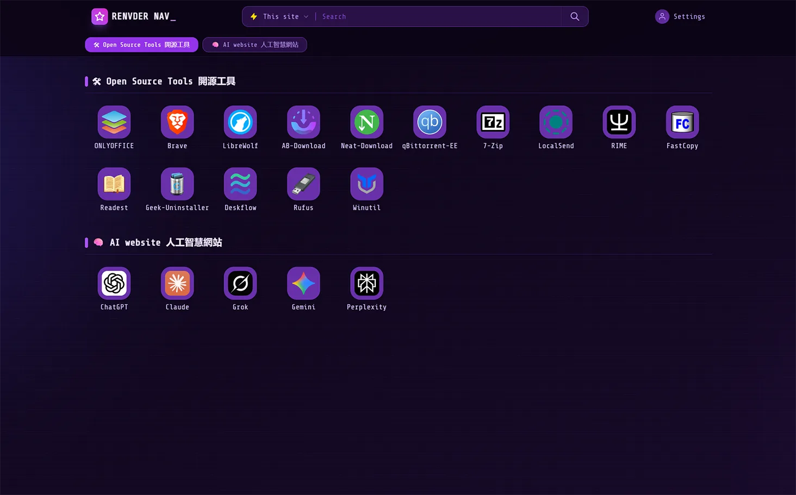

  🌐 <a href="./README.md"><b>EN</b></a> |
  <b>漢</b>

  <h1>cf-workers-nav 個人導航頁</h1>
  

    部署於 Cloudflare 上的輕量化導航頁
     
    <i>⚡ 輕鬆打造屬於自己的瀏覽器起始頁</i>
  

📋 輕鬆部署的個人導航頁 

> 一款部署於 Cloudflare 上的輕量化導航頁面。
> 整合書籤管理、圖示自動擷取、拖曳排序、私密連結保護等功能，Worker 單一檔案設計，方便快速部署。

## ✨ 主要特色

*   **⚡️ Serverless 架構**：完全執行於 Cloudflare Workers 上，無需維護伺服器。
*   **💾 KV 儲存空間**：資料安全儲存於 Cloudflare KV 中。
*   **🎨 簡潔 UI**：基於 Tailwind CSS，響應式設計完美相容電腦與行動裝置，並提供卡片視圖與 APP 視圖兩種顯示風格。
*   **🌗 自動跟隨系統的深色模式**：電腦與手機都會自動採用裝置目前的淺色/深色設定，系統切換時（例如定時日夜模式）頁面也會即時跟著切換。也可在「設定」選單手動切換；手動選擇只有在開啟 **Remember Settings（記住設定）** 時才會跨次記住。
*   **🖱️ 拖曳排序**：支援電腦端滑鼠拖曳與行動裝置長按拖曳，輕鬆整理分類與卡片順序。
*   **🔒 私密保護**：支援設定「私密連結」，僅在管理員登入後可見。登入失敗有次數限制（錯誤 5 次，該 IP 鎖定 15 分鐘）。
*   **📂 資料管理**：支援線上新增/編輯/刪除連結，可匯入 Chrome / Edge 的 HTML 書籤，並支援 JSON 格式資料匯入/匯出。每次儲存都會自動備份舊資料（每 10 分鐘最多一份，保留最新 10 份）。
*   **🩺 一鍵檢測**（需登入）：直接從瀏覽器檢查每個網站是否可連線及回應速度。
*   **🔍 整合搜尋**：內建多款搜尋引擎（Google、Bing、DuckDuckGo）及站內快捷搜尋。

## 介面預覽

### 瀏覽視圖
| 卡片視圖 | 行動裝置視圖 |
|-|-|
| | |

### 編輯模式視圖
| 卡片視圖 | 行動裝置視圖 |
|-|-|
| | |

## 部署方式

### 部署至 Cloudflare

點擊展開部署步驟

#### 部署步驟

1. **登入 [Cloudflare](https://www.cloudflare.com)** 並建立 Worker：
   - 複製儲存庫中 `workers.js` 的程式碼，貼入 Worker 編輯器中，點擊部署。

2. **建立 KV 儲存空間**：
   - 在 Cloudflare 控制台的 **Workers & Pages > KV** 中建立名為 `CARD_ORDER` 的 KV 命名空間，用於儲存資料。

3. **綁定 KV 命名空間**：
   - 在 Worker 的 **設定 > 繫結**（舊版控制台為 **設定 > 變數 > KV 命名空間繫結**）新增 KV 繫結，變數名稱填寫 `CARD_ORDER`，並綁定至上一步建立的 `CARD_ORDER` 命名空間。

4. **設定環境變數 / 參數**：
   - 到 Worker 的 **設定 > 變數和機密**，依下方表格新增各項變數。
   - `ADMIN_PASSWORD` 與 `JWT_SECRET` 請選擇類型 **機密（Secret）**，儲存後內容會加密並隱藏；其他變數使用類型 **文字（Text）** 即可。
   - 設定完成後務必點擊 **部署**，變更才會生效。

5. **新增自訂網域**（選填）：
   - 若需使用自訂網域，可在 Worker 的 **設定 > 網域與路由** 中新增自訂網域，或直接使用 `*.workers.dev` 子網域。

 

#### 環境變數說明

> 表中標註了「必填」與「選填」；未設定選填項目時將使用預設值。

| 變數名稱 | 必填 | 說明 | 預設值 |
|---|---|---|---|
| `ADMIN_PASSWORD` | ✅ 必填 | 管理員登入密碼，長度至少 **8 個字元**（建議使用長且獨一無二的密碼） | 無 |
| `JWT_SECRET` | ✅ 必填 | 用於簽署登入 Token 的金鑰，必須是 **≥32 個字元** 的隨機字串（可用密碼管理器產生） | 無 |
| `DEFAULT_USER` | ⬜ 選填 | 資料識別名稱。你的連結會以此名稱存放在 KV 中，之後若更改，頁面會改讀另一份（空白的）資料，舊資料仍留在 KV 的舊名稱下 | `testUser` |
| `ALLOWED_ORIGINS` | ⬜ 選填 | 允許從其他網域呼叫 API (CORS) 的來源，多個來源請用半形逗號分隔。只有需要從其他網站呼叫 API 時才需設定 | 空白（僅限同源） |
| `ICON_API` | ⬜ 選填 | 第三方圖示 API。網站網址會經 URL 編碼後直接接在此值後面，因此值必須以查詢參數結尾，例如 `https://api.xinac.net/icon/?url=` | 已內建 xinac |
| `PREFER_ICON_API` | ⬜ 選填 | `true`：優先向圖示 API 取得圖示，失敗再改由網站本身取得。`false`：完全不連線第三方 API，直接從各網站取得圖示（**較保護隱私**，見下方說明）。請填小寫的 `true` 或 `false`，其他值一律視為 `false` | `true` |

#### 🔐 隱私建議：`PREFER_ICON_API`

預設（`true`）時，Worker 會把**每個連結的網址傳給圖示 API**（預設為 xinac）以取得圖示，登入後顯示的私密連結也包含在內。

若不想把連結交給第三方，請在 **設定 > 變數和機密** 新增 `PREFER_ICON_API` = `false` 並點擊 **部署**。之後圖示會直接從各網站取得（先試 `/favicon.ico`，再讀取網頁中宣告的圖示）。代價是：少數網站無法取得圖示時，會顯示預設圖示。

> 已取得的圖示最多會快取 7 天，因此需等舊圖示過期後，變更才會完全生效。

#### 舊版本升級提醒

> - 舊版本若**未設定 `JWT_SECRET`**，或設定的 `JWT_SECRET` **少於 32 個字元**，必須重新設定一個 **≥32 個字元** 的隨機字串，否則 Worker 會拒絕執行，並回傳 `Server is not configured`（HTTP 500），訊息為 `JWT_SECRET is not configured or not strong enough (needs ≥ 32 characters)`。
> - 舊版本若 **`ADMIN_PASSWORD` 少於 8 個字元**，請一併更新為**至少 8 個字元**的新密碼，否則同樣會出現上述錯誤。
> - 修改變數後需點擊 **部署**，設定才會生效。
> - 舊版本會把自動偵測到的主題存進瀏覽器，導致頁面之後不再跟隨系統變化。新版會忽略這個舊值，不需要手動清除。

## 🛡️ 隱私與安全說明

* **圖示服務**：請見上方 `PREFER_ICON_API` 隱私建議。
* **瀏覽器載入的第三方資源**：頁面會從 `cdn.tailwindcss.com` 載入 Tailwind CSS，並從 Google Fonts 載入字型。管理員登入 Token 存放在瀏覽器的 `localStorage`，因此在共用或公用電腦上編輯後，務必使用 **Login / Logout** 登出；在自己的個人裝置上則可保持登入。
* **登出會讓所有裝置一起登出**：登出會撤銷所有現有登入狀態（手機、電腦都會掉線）。登出請求必須帶有效的登入 Token 才會生效，外人無法強制讓你被登出。
* **私密連結**由伺服器端過濾：未登入的訪客根本不會收到這些資料。
* **登入保護**：密碼錯誤 5 次會鎖定該來源 IP 15 分鐘。登入 Token 有效期 2 小時，並透過 HttpOnly Cookie 自動續期（最長 30 天）。

## 📝 更新紀錄

**2026-09-19**
* 深色模式：頁面現在能真正跟隨系統主題，包含即時切換。手動選擇只有在開啟 **Remember Settings** 時才會儲存，且開啟該選項時會儲存目前實際使用的主題。新增 `color-scheme` / `theme-color`，讓原生控制項與手機瀏覽器網址列配合主題顏色。
* 安全性：`/api/logout` 現在必須帶有效的登入 Token。
* 文件：新增 `PREFER_ICON_API` 隱私建議；修正搜尋引擎清單（實際為 DuckDuckGo，而非百度）；修正 `ALLOWED_ORIGINS` 預設值（僅限同源，而非不限制）；補充 `JWT_SECRET`、`ICON_API`、`DEFAULT_USER` 的說明。

## 🙏 致謝

特別感謝 **[Cloudflare](https://www.cloudflare.com/)**、**[Tailwind CSS](https://tailwindcss.com/)**、**[hmhm2022](https://github.com/hmhm2022)**、**[xinac](https://api.xinac.net/)**。
