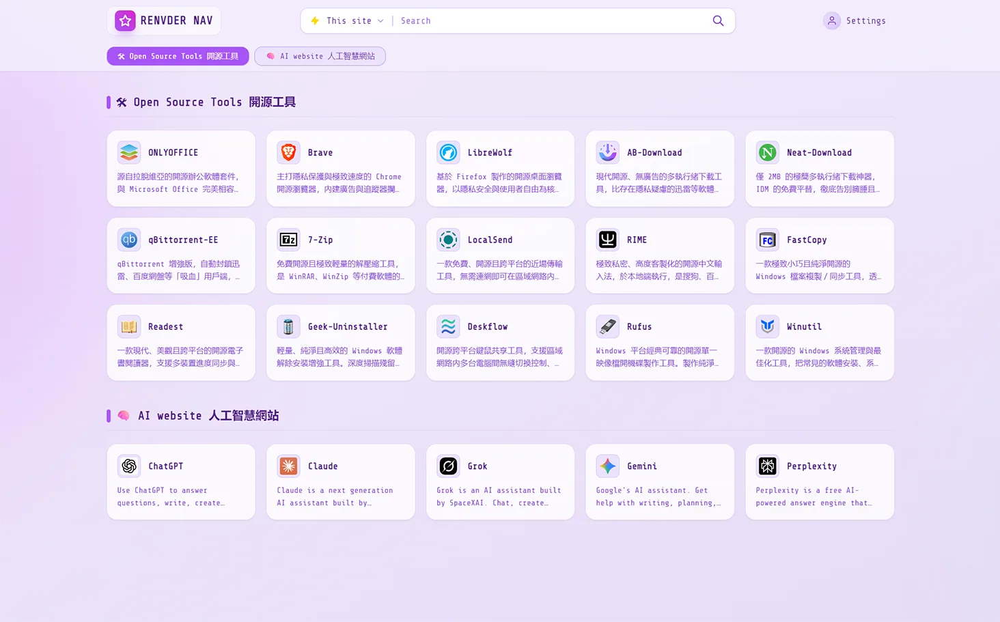
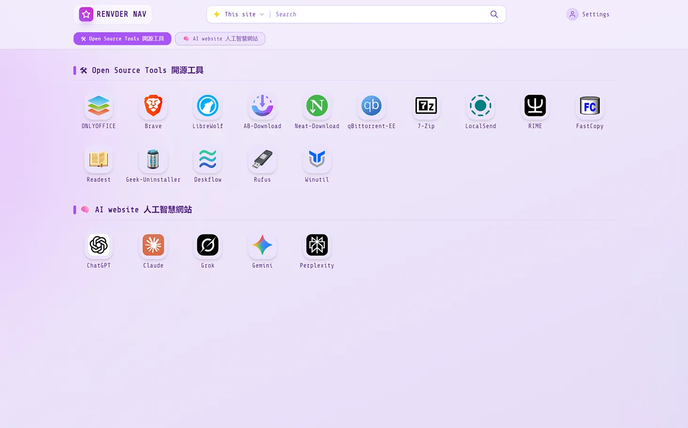
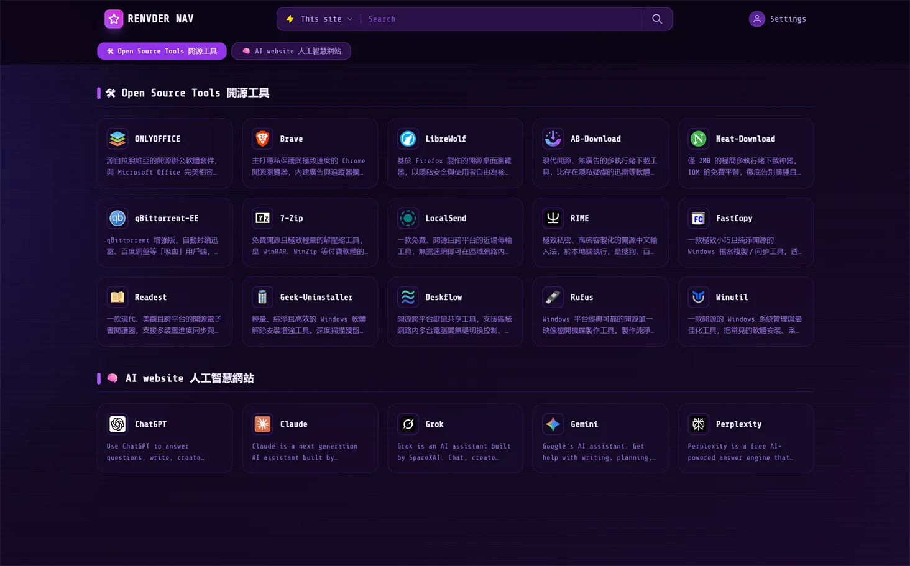

  🌐 <b></b>
  <a href="./README.md"><b>EN</b></a> | 
  <b>漢</b></a>

  <h1>cf-workers-nav 個人導航頁</h1>
  

    部署於 Cloudflare 上的輕量化導航頁
     
    <i>⚡ 輕鬆打造屬於自己的瀏覽器起始頁</i>
  

📋 輕鬆部署的個人導航頁 

> 一款部署於 Cloudflare 上的輕量化導航頁面。
> 整合書籤管理、圖示自動擷取、拖曳排序、私密連結保護等功能，Worker 單一檔案設計，方便快速部署。

## ✨ 主要特色

*   **⚡️ Serverless 架構**：完全執行於 Cloudflare Workers 上，無需維護伺服器。
*   **💾 KV 儲存空間**：資料安全儲存於 Cloudflare KV 中。
*   **🎨 簡潔 UI**：基於 Tailwind CSS，支援**深色模式**自動/手動切換，響應式設計完美相容電腦與行動裝置。
*   **🖱️ 拖曳排序**：支援電腦端滑鼠拖曳與行動裝置長按拖曳，輕鬆整理分類與卡片順序。
*   **🔒 私密保護**：支援設定「私密連結」，僅在管理員登入後可見。
*   **📂 資料管理**：支援線上新增/編輯/刪除連結，可匯入 Chrome / Edge 的 HTML 書籤，並支援 JSON 格式資料匯入/匯出與自動備份。
*   **🔍 整合搜尋**：內建多款搜尋引擎（Google, Bing, Baidu）及站內快捷搜尋。

## 介面預覽

### 瀏覽視圖
| 卡片視圖 | 行動裝置視圖 |
|-|-|
| | |

### 編輯模式視圖
| 卡片視圖 | 行動裝置視圖 |
|-|-|
| | |

## 部署方式

### 部署至 Cloudflare

點擊展開部署步驟

#### 部署步驟

1. **登入 [Cloudflare](https://www.cloudflare.com)** 並建立 Worker：
   - 複製儲存庫中 `workers.js` 的程式碼，貼入 Worker 編輯器中，點擊部署。

2. **建立 KV 儲存空間**：
   - 在 Cloudflare 控制台的 **Workers & Pages > KV** 中建立名為 `CARD_ORDER` 的 KV 命名空間，用於儲存資料。

3. **綁定 KV 命名空間**：
   - 在 Worker 的 **設定 > 變數** 中新增 KV 命名空間綁定，變數名稱填寫 `CARD_ORDER`，並綁定至上一步建立的 `CARD_ORDER` 命名空間。

4. **設定環境變數 / 參數**：
   - 各項必填與選填設定請參考下方表格。

5. **新增自訂網域**（選填）：
   - 若需使用自訂網域，可在 Worker 的 **設定 > 網域與路由** 中新增自訂網域，或直接使用 `*.workers.dev` 子網域。

 

#### 環境變數說明

> 表中標註了「必填」與「選填」；未設定選填項目時將使用預設值。

| 變數名稱 | 必填 | 說明 | 預設值 |
|---|---|---|---|
| `ADMIN_PASSWORD` | ✅ 必填 | 管理員登入密碼，長度至少 **8 個字元** | 無 |
| `JWT_SECRET` | ✅ 必填 | 用於加密 Token 的金鑰，建議為 **≥32 個字元** 的隨機字串 | 無 |
| `DEFAULT_USER` | ⬜ 選填 | 預設使用者標示 | `testUser` |
| `ALLOWED_ORIGINS` | ⬜ 選填 | 允許跨網域存取 (CORS) 的來源，多個來源請用半形逗號分隔 | 空白（不限制） |
| `ICON_API` | ⬜ 選填 | 圖示 API 位址 | 已內建 xinac |
| `PREFER_ICON_API` | ⬜ 選填 | 是否優先使用圖示 API | `true` |

> **注意（舊版本升級提醒）：**
> - 舊版本若**未設定 `JWT_SECRET`**，或設定的 `JWT_SECRET` **少於 32 個字元**，必須重新設定一個 **≥32 個字元** 的隨機字串，否則 Worker 會因設定驗證失敗（`JWT_SECRET 未配置或强度不足`）而無法正常運作。
> - 舊版本若 **`ADMIN_PASSWORD` 少於 8 個字元**，請一併更新為**至少 8 個字元**的新密碼，否則同樣會觸發設定驗證失敗。
> - 修改後需重新部署（或點擊「儲存並部署」）使設定生效。

## 🙏 致謝

特別感謝 **[Cloudflare](https://www.cloudflare.com/)**、**[Tailwind CSS](https://tailwindcss.com/)**、**[hmhm2022](https://github.com/hmhm2022)**、**[xinac](https://api.xinac.net/)**。
